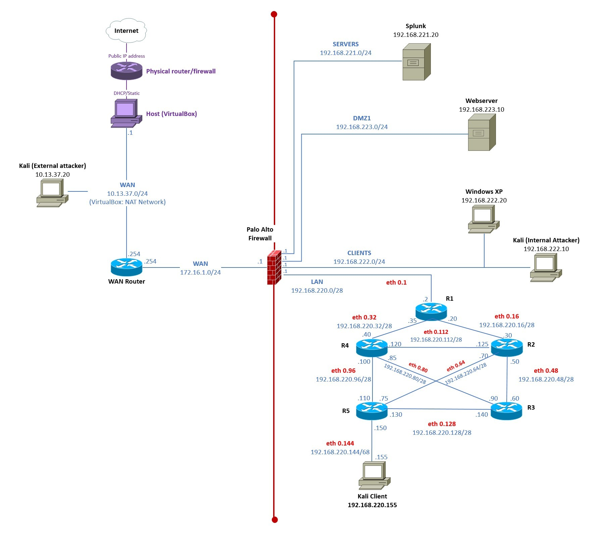

# MSN-Final-Project

We provide a detailed documentation of the project in the ```doc``` folder. The documentation is written in Microsoft Word and not in LaTeX, due to mandatory conditions of the Course. The documentation is also available in ```pdf``` format.
## Network Implementation Plan

### Mandatory components

The mandatory network design mustv follow the following requirements:

**LAN**: 192.168.220.0/24  
**NUM_ROUTERS_MIN**: 5  
**PROTECTION**: 1 Firewall (Palo Alto) | SIEM Splunk

### Project Implementation
The actual implementation of the network is shown in the following diagram:



The segments of the teworks are defined as follows:

**LAN:** a network where the 5 routers were configured to communicate with one another using the Dynamic Routing Protocol as known as RIP. We also added a Kali Client machine to ensure everything works correctly; 

**CLIENTS:** a network only made by a Kali machine (that will act as our Internal Attacker) and a Windows XP machine (that will act as the victim); 

**SERVERS:** a network where our SIEM Splunk service is hosted: it will be accessed by the Kali Internal (instead of another client, due to computational issues), which will in fact act as both the attacker and the defender in our network; 

**DMZ1:** a network where our Webserver is located. It will provide a service to both our Internal Networks and to the External Network too, as the content of a DMZ can be accessible also from the internet. The only machine in this DMZ will be a vulnerable Webserver, that we’ll have to protect from exploits coming from either the Internal of the External network. 

For scalability purposes we chose to assign the 192.168.220.0/24 interval to the LAN network and everything attached to it, while for the other segments we selected the IP addresses that follow 192.168.220.0/24, so we used 192.168.221.0/24, 192.168.222.0/24 and 192.168.223.0/24 for the SERVERS, CLIENTS and DMZ1 networks respectively.

## Attacks Implementation

### Mandatory components
The mandatory network design mustv follow the following requirements:

**NUM_DOS_ATTACKS_MIN**: 3  
**NUM_RECON_ATTACKS_MIN**: 2  
**EXTRA_ATTACKS**: 1 DNS Attack 

We called the script **DREX**: **D**enial of service, **R**econ and **E**xploits e**X**ecutor. The code is visible in the Python script DREX.py

### Project Implementation
The actual implementation of the attacks is the following:

**NUM_DOS_ATTACKS_MIN**: 6  
**NUM_RECON_ATTACKS_MIN**: 4  
**EXTRA_ATTACKS**: DNS Amplification and SQL Injection in the webserver 

## Defense Implementation
In term of defensive strategies, we chose SIEM Splunk as an Intrusion Detection and Intrusion Prevention system, as well as the default Palo Alto Advanced Defence mechanism, that allow for a quick traffic analysis. We also integrated the Splunk tool with the Splunk Machine-Learning-Toolkit as known as SPLUNK’s mltk, a set of Machine Learning based models that allow for an optimized Anomaly Detection system and defensive mechanisms. 

## Conclusion and Recommendations
The project aims to identify and address the potential risks faced by an IT company when it employs a malicious user which behaves as an internal threat. It also explores the various attacks that the malicious user could execute within the organization and highlight possible defensive mechanism that the corporation can assume. 

We tried to show both the severity of the attacks and robustness of the defensive mechanism, especially focusing on the State-of-the-Art mechanism as the New Generation Firewall by Palo Alto and the Splunk SIEM and MLTK.  Some of the attacks have been mitigated, while others are more difficult to detect or patch; the SQL injection for example is quite challenging to be fixed as it doesn’t simply require an “additional tool”, but a rebuilding of the database and the way it can be accessed. 

Overall, this project, with all the physical restrictions that Virtual Machines and our not-so-perfect laptops, has been quite challenging and very rewarding. It allowed us to have a hands-on approach on the topics of Network Security, and it has been a great experience overall.

## References:
- Website for the cool looking dot art: https://patorjk.com/software/taag/#p=display&f=Avatar&t=Exploits
- Scapy Documentation: https://scapy.net/ 
- TTL Os Detection: https://ostechnix.com/identify-operating-system-ttl-ping/#:~:text=The%20TTL%20value%20varies%20depends,Mac%20OS%2C%20Solaris%20and%20Windows
- Palo Alto Documentation: https://docs.paloaltonetworks.com/best-practices/dos-and-zone-protection-best-practices/dos-and-zone-protection-best-practices/deploy-dos-and-zone-protection-using-best-practices 
